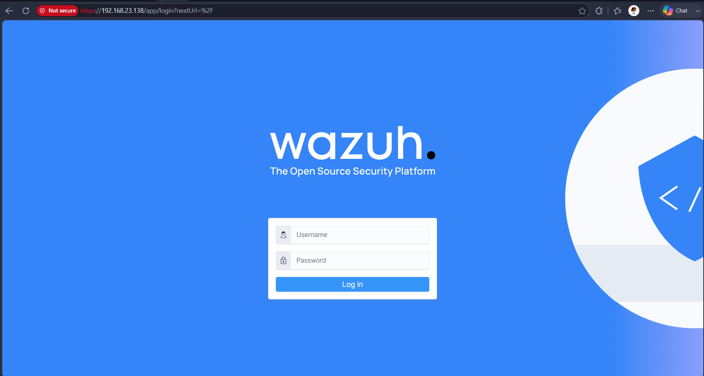
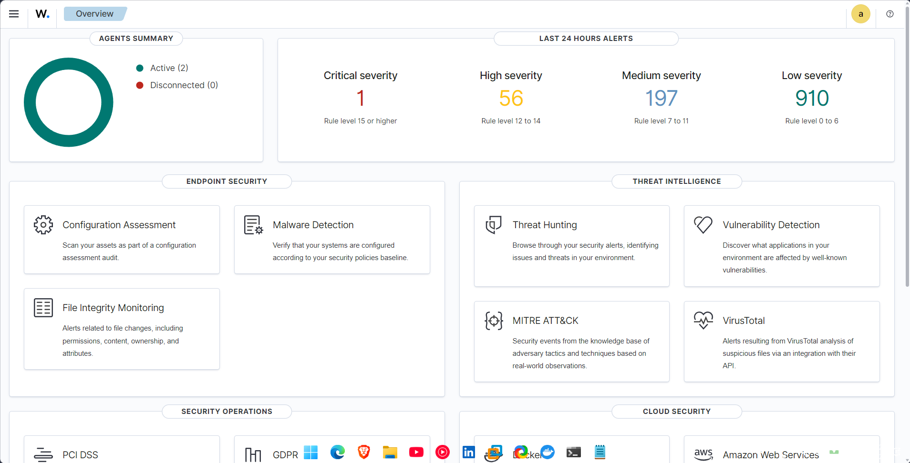
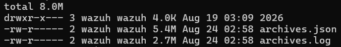
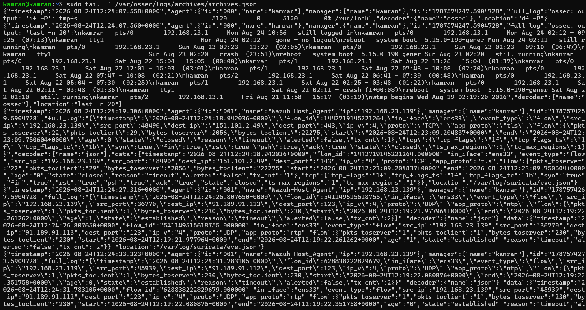

# 01 — Manager Setup (Wazuh Host, Ubuntu Server 22.04)

Installs the Wazuh Manager, Indexer, and Dashboard as a single-node all-in-one stack. Everything else in this lab depends on this being up first.

## What's being tested

That the SIEM core is installed correctly, the admin credentials are recoverable, and raw logs are actually landing in the Indexer and visible in the Dashboard before any agent is even enrolled.

## Commands

### Install
```bash
curl -sO https://packages.wazuh.com/4.9/wazuh-install.sh
sudo bash wazuh-install.sh -a
```
This prints the admin password at the end of the run — **save it immediately, then redact it from any screenshot.**

### Password recovery / reset (keep for reference, not required on a fresh install)
```bash
sudo tar -axf wazuh-install-files.tar wazuh-install-files/wazuh-passwords.txt -O
sudo cat /root/wazuh-install-files/wazuh-passwords.txt
sudo find / -name "wazuh-passwords.txt" 2>/dev/null
sudo /usr/share/wazuh-indexer/plugins/opensearch-security/tools/wazuh-passwords-tool.sh --help
sudo /usr/share/wazuh-indexer/plugins/opensearch-security/tools/wazuh-passwords-tool.sh -a
sudo /usr/share/wazuh-indexer/plugins/opensearch-security/tools/wazuh-passwords-tool.sh -u admin -p NEWPASSWORD
sudo systemctl restart wazuh-indexer
sudo systemctl restart wazuh-manager
sudo systemctl restart wazuh-dashboard
```

### Verify archives are being generated
```bash
sudo ls -lh /var/ossec/logs/archives/
sudo tail -f /var/ossec/logs/archives/archives.json
```

### Filebeat config (ships logs Manager → Indexer)
```bash
sudo nano /etc/filebeat/filebeat.yml
```

## Screenshot Evidence

| # | Screenshot | What it captures |
|---|---|---|
| 1 |  | Wazuh Dashboard login page loading successfully in the browser. |
| 2 |  | Wazuh Dashboard home/overview displayed after logging in with the recovered administrator credentials. |
| 3 |  | Manager terminal showing that the Wazuh archive log files are present and being generated. |
| 4 |  | Live `archives.json` output showing raw events flowing into the Wazuh archive log. |
## Analyst notes

- The admin password from install is a one-time credential — in a real deployment this would be rotated immediately and stored in a secrets manager, not left as the standing admin password.
- `wazuh-archive-*` logs everything, not just alerts — useful for hunting, but it's high-volume; in production you'd tune retention/ILM on this index specifically so it doesn't outgrow the alerts index.
- If `archives.json` isn't updating, check Filebeat's output block in `filebeat.yml` before assuming the Manager itself is broken — this is the most common silent failure point in a fresh install.
