# 02 — Linux Agent Detections (Wazuh Ubuntu Agent, Ubuntu Server 22.04)

Three detections on the Linux endpoint: network intrusion (Suricata), malicious command execution (auditd), and SSH brute force with an automated firewall block.

## What's being tested

Whether the agent surfaces attacker behavior at three different layers — network (packets), host (process execution), and authentication (failed logins) — and whether the Manager can automatically respond to the last one without a human clicking anything.

## Agent enrolment

```bash
# Copy the install command from Dashboard → Agents → Deploy new agent (select Linux, paste Manager IP), run it on the agent, then:
sudo systemctl enable wazuh-agent
sudo systemctl start wazuh-agent
```

---

## A. Network Intrusion Detection (Suricata)

### Commands
```bash
# Install
sudo add-apt-repository ppa:oisf/suricata-stable -y
sudo apt update
sudo apt install suricata suricata-update -y
sudo suricata -V

# Update rules
sudo suricata-update
ls -lh /var/lib/suricata/rules/

# Find your interface
ifconfig

# Configure (edit HOME_NET, af-packet interface, eve-log output — see main guide for full block)
sudo nano /etc/suricata/suricata.yaml

# Test and start
sudo suricata -T -c /etc/suricata/suricata.yaml
sudo systemctl enable suricata
sudo systemctl restart suricata
sudo systemctl status suricata
sudo tail -f /var/log/suricata/eve.json
```
Point the Wazuh agent at Suricata's log by adding the `<localfile>` block (json, `/var/log/suricata/eve.json`) to `ossec.conf`, then:
```bash
sudo systemctl restart wazuh-agent
sudo systemctl status wazuh-agent
```
**Trigger from Kali Machine:**
```bash
nmap -sS -Pn <Wazuh Ubuntu Agent IP>
```

---

## B. Detecting Malicious Commands (auditd)

### Commands
```bash
sudo apt update
sudo apt install auditd audispd-plugins -y
sudo systemctl enable auditd
sudo systemctl start auditd
sudo systemctl status auditd
sudo tail -f /var/log/audit/audit.log
```
Ship the log to Wazuh (`<localfile>` block, `audit` format, `/var/log/audit/audit.log`), then:
```bash
sudo systemctl restart wazuh-agent
```
Watch specific binaries:
```bash
sudo nano /etc/audit/rules.d/audit.rules
```
```
-w /usr/bin/wget -p x -k wget_execution
-w /usr/bin/curl -p x -k curl_execution
-w /usr/bin/nc -p x -k nc_execution
-w /usr/bin/nmap -p x -k nmap_execution
-w /usr/bin/bash -p x -k bash_execution
-w /usr/bin/python3 -p x -k python_execution
```
```bash
sudo augenrules --load
sudo auditctl -l
```
**Trigger:**
```bash
wget http://example.com/test.sh
curl http://example.com
nc -lvnp 4444
nmap localhost
```
**Verify capture:**
```bash
sudo ausearch -k wget_execution
sudo tail -f /var/log/audit/audit.log
```
Add rule 100300 to `local_rules.xml` (Dashboard → Management → Rules), then:
```bash
sudo systemctl restart wazuh-manager   # on Wazuh Host
```
Trigger `wget`/`curl` again on the agent and confirm the alert.

---

## C. Detecting and Blocking SSH Brute Force

**Architecture:** Kali → agent logs failed SSH → Manager detects brute force (rules 5710/5712/5715) → Manager sends active response → agent executes `firewall-drop` → Kali IP blocked.

### Commands
On the **Manager**, add the `<active-response>` block (`firewall-drop`, rules `5710,5712,5715,5760,5763`) to `ossec.conf`:
```bash
sudo nano /var/ossec/etc/ossec.conf
sudo ls /var/ossec/etc/shared/ar.conf
```
On the **Agent**, confirm `firewall-drop` exists and active response is enabled:
```bash
sudo ls /var/ossec/active-response/bin/
sudo nano /var/ossec/etc/ossec.conf   # <active-response><disabled>no</disabled></active-response>
sudo systemctl restart wazuh-manager   # Wazuh Host
sudo systemctl restart wazuh-agent     # Wazuh Ubuntu Agent
```
**Attack from Kali Machine:**
```bash
hydra -l root -P pass.txt ssh://<Wazuh Ubuntu Agent IP>
```
**Verify block on the agent:**
```bash
sudo iptables -L
ssh user@<Wazuh Ubuntu Agent IP>   # run from Kali — should now fail
sudo tail -f /var/ossec/logs/active-responses.log
```
Troubleshooting:
```bash
sudo grep firewall-drop /var/ossec/etc/ossec.conf
```
Unblock manually if needed:
```bash
sudo iptables -D INPUT -s KALI_IP -j DROP
```

---

## Screenshot Evidence

### 01 — Agent Connected

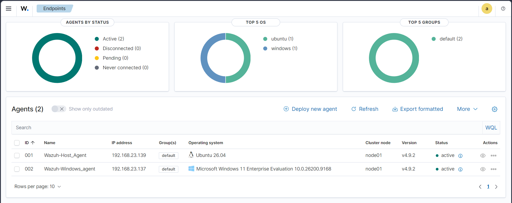

### 02 — Suricata Installed

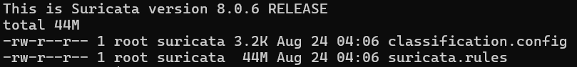

### 03 — Suricata Config Test Pass

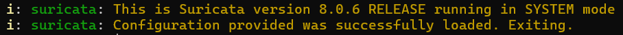

### 04 — Suricata Running

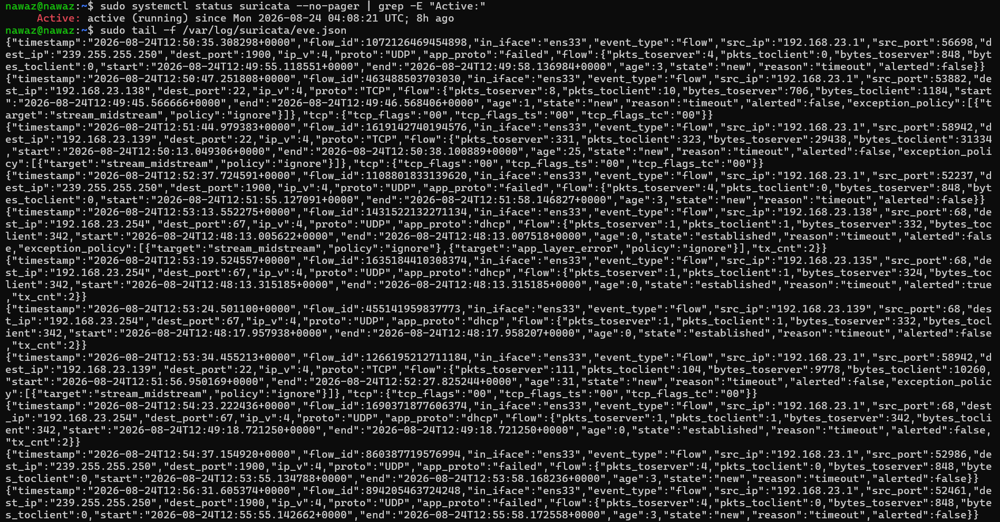

### 05 — Nmap Scan from Kali

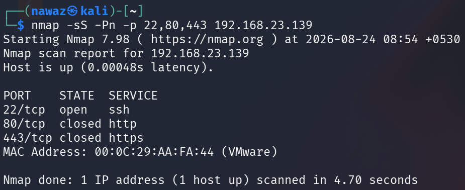

### 06 — Suricata Alert Dashboard

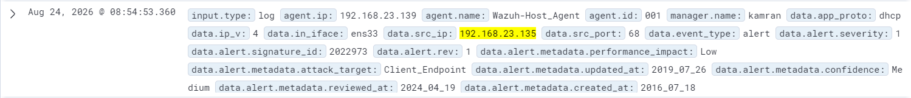

### 07 — auditd Active

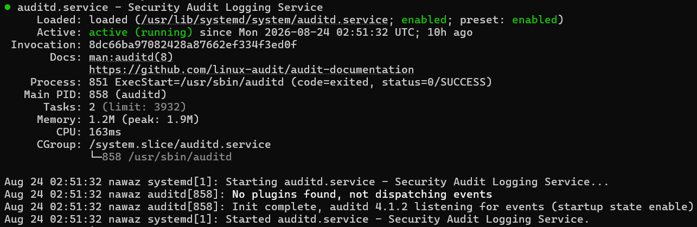

### 08 — Audit Rules Loaded

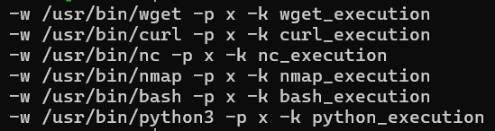

### 09 — Trigger Commands

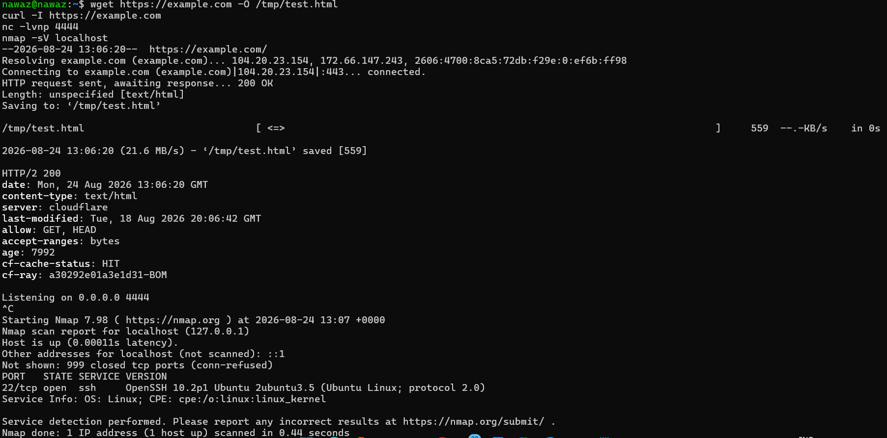

### 10 — ausearch Capture

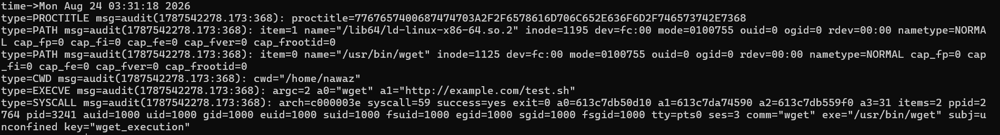

### 11 — Local Rule 100300

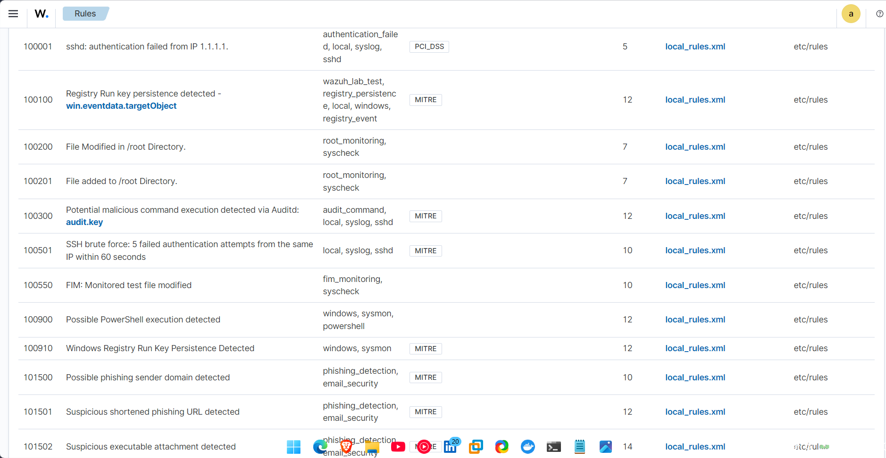

### 12 — auditd Alert Dashboard

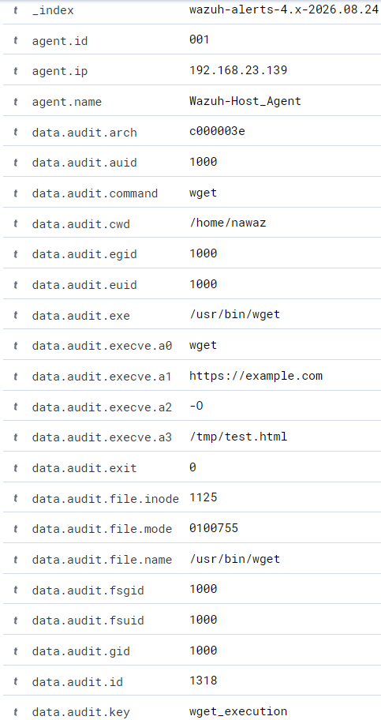

### 13 — Active Response Config

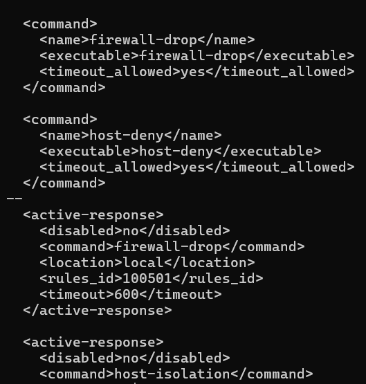

### 14 — Hydra Attack

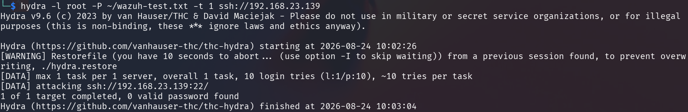

### 15 — iptables Block

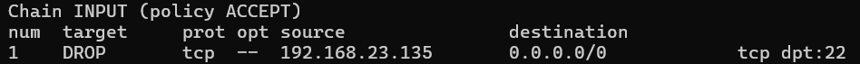

### 16 — SSH Blocked

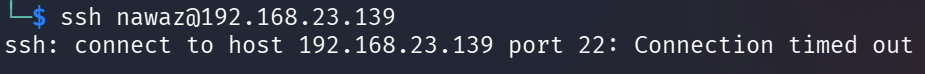

### 17 — Active Response Log

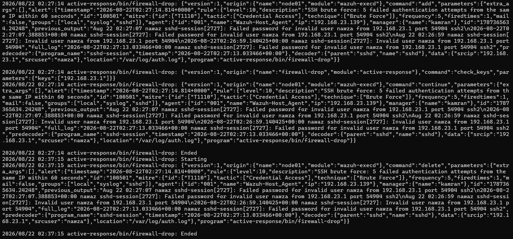

### 18 — Brute Force Alert Dashboard

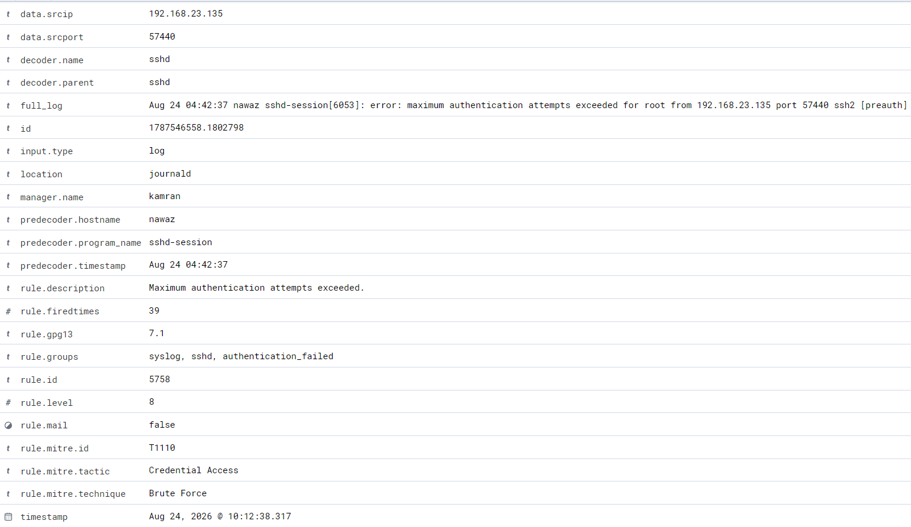

## Analyst notes

- **Suricata/nmap:** a single `-sS -Pn` scan is a clean signal in a lab; in production this rule would need tuning against internal vulnerability scanners to avoid false positives — check the source IP allowlist before escalating.
- **auditd:** watching `bash`/`python3` execution is noisy on a real host (both run constantly for legitimate reasons); the useful signal here is the *combination* of binary + unusual parent process or user context, which would be the next iteration of this rule.
- **SSH brute force + active response:** the `timeout 600` on the firewall-drop is a lab convenience — in production you'd also log/alert on the block itself (not just the trigger) so an analyst knows an active response fired, and you'd whitelist known-good IPs (e.g. jump boxes) so a legitimate user with a bad password doesn't get auto-blocked.
