# 04 — Cross-Platform Detections (Wazuh Ubuntu Agent and/or Windows 11)

File Integrity Monitoring, CVE-based vulnerability detection, VirusTotal file reputation, and a simulated phishing-log detection — all run identically regardless of endpoint OS.

## What's being tested

Detections that don't depend on the endpoint's platform: file changes, known vulnerabilities, malicious file reputation, and log-based content matching (phishing indicators).

> The n8n hash-lookup + Telegram alerting workflow that extends FIM/VirusTotal now lives in its own section: [`05-n8n-fim-automation/`](../05-n8n-fim-automation/).

---

## A. File Integrity Monitoring (FIM)

### Commands
**On the Manager:**
```bash
sudo nano /var/ossec/etc/ossec.conf
# Under <global>: <logall>yes</logall> and <logall_json>yes</logall_json>
sudo systemctl restart wazuh-manager
```
**On the Linux agent:**
```bash
sudo nano /var/ossec/etc/ossec.conf
# <directories check_all="yes" report_changes="yes" realtime="yes">/root</directories>
sudo systemctl restart wazuh-agent
touch /root/testfile
```
**On the Windows agent:**
```powershell
# ossec.conf: <directories check_all="yes" report_changes="yes" realtime="yes">C:\Users\Public</directories>
Restart-Service wazuh-agent
New-Item -Path "C:\Users\Public\testfile.txt" -ItemType File
```
Check both land under **Discover → syscheck**.

---

## B. Vulnerability Detection (Manager-side, covers every connected agent)

### Commands
```bash
sudo nano /var/ossec/etc/ossec.conf
# <vulnerability-detector><enabled>yes</enabled></vulnerability-detector>
sudo systemctl restart wazuh-manager
```
Check the Dashboard's **Vulnerabilities** module for both agents.

---

## C. VirusTotal Integration

Create a free VirusTotal account → profile → API key.

FIM must already be enabled (section A). Add rules 100200/100201 to `local_rules.xml`, then the `<integration>` block (`virustotal`, your API key, `rule_id=100200,100201`, `alert_format=json`):
```bash
sudo systemctl restart wazuh-manager
```
**Drop the EICAR test file** (safe, industry-standard AV test string — not real malware):
```bash
# Linux
sudo curl -Lo /root/eicar.com https://secure.eicar.org/eicar.com && sudo ls -lah /root/eicar.com
```
```powershell
# Windows — temporarily exclude the folder in Defender first, or it'll be quarantined instantly
Invoke-WebRequest -Uri https://secure.eicar.org/eicar.com -OutFile C:\Users\Public\eicar.com
```

---

## D. Phishing Mail Identification

### Commands
Create a fake log source:
```bash
sudo touch /var/log/phishing-mails.log          # Linux
```
```powershell
New-Item -Path "C:\phishing-logs\phishing-mails.log" -ItemType File -Force   # Windows
```
Add the `<localfile>` block (`syslog` format) to `ossec.conf`, then:
```bash
sudo systemctl restart wazuh-agent    # or Restart-Service wazuh-agent on Windows
```
Add rules 100500–100503 to `local_rules.xml`, then:
```bash
sudo systemctl restart wazuh-manager
```
**Trigger (Linux):**
```bash
echo "From: support@paypa1.com Subject: Verify account now http://bit.ly/login Attachment: invoice.exe" | sudo tee -a /var/log/phishing-mails.log
```
**Trigger (Windows):**
```powershell
Add-Content -Path "C:\phishing-logs\phishing-mails.log" -Value 'From: support@paypa1.com Subject: Verify account now http://bit.ly/login Attachment: invoice.exe'
```
Check **Agents → Security events**.

---

## Screenshot Evidence

| # | Screenshot | What it captures |
|---|---|---|
| 1 | 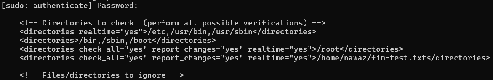 | Linux Wazuh agent `ossec.conf` showing `/root` directory configured for File Integrity Monitoring (FIM). |
| 2 | 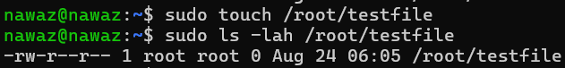 | Linux test file being created in `/root` to generate an FIM event. |
| 3 | 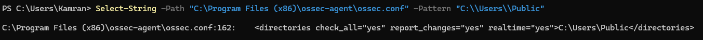 | Windows Wazuh agent `ossec.conf` showing `C:\Users\Public` configured for FIM. |
| 4 | 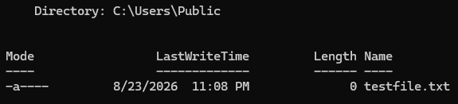 | Windows test file being created in `C:\Users\Public` to generate an FIM event. |
| 5 |  | Wazuh Dashboard → Discover → `syscheck` showing the Linux and Windows FIM events. |
| 6 | 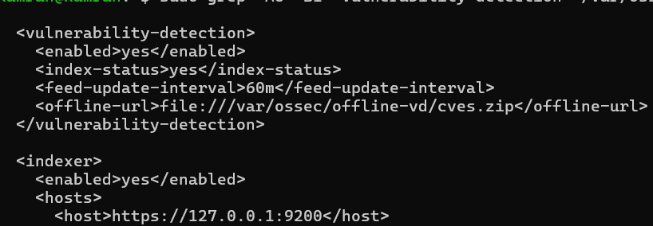 | Wazuh Manager `ossec.conf` showing the `vulnerability-detector` module enabled. |
| 7 | 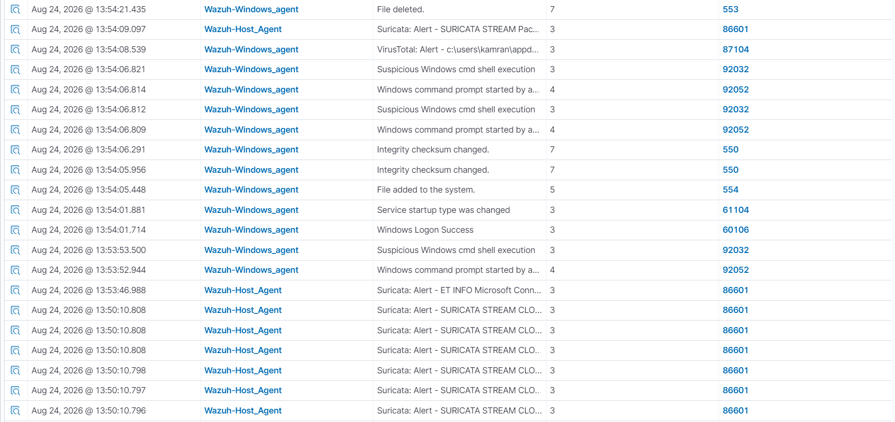 | Wazuh Dashboard Vulnerabilities module showing vulnerability findings for both connected agents. |
| 8 | 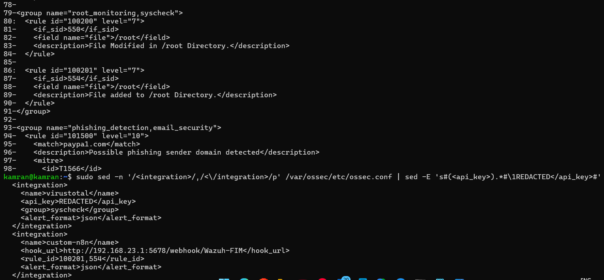 | Manager `local_rules.xml` showing rules `100200`/`100201` and the VirusTotal `<integration>` block. |
| 9 | 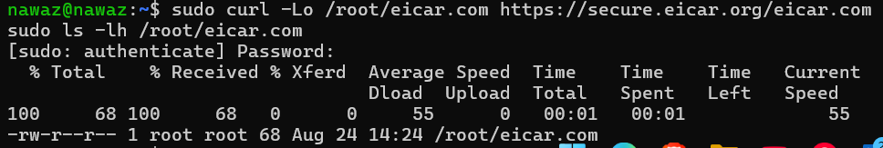 | EICAR test file being downloaded to the agent as the safe malware-detection test artifact. |
| 10 | 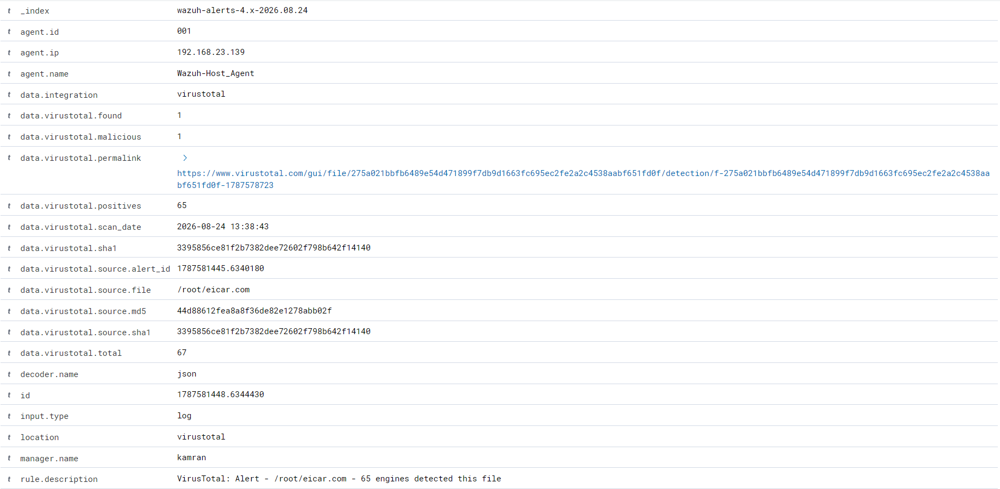 | Wazuh Dashboard alert showing the VirusTotal verdict for the EICAR test file. |
| 11 | 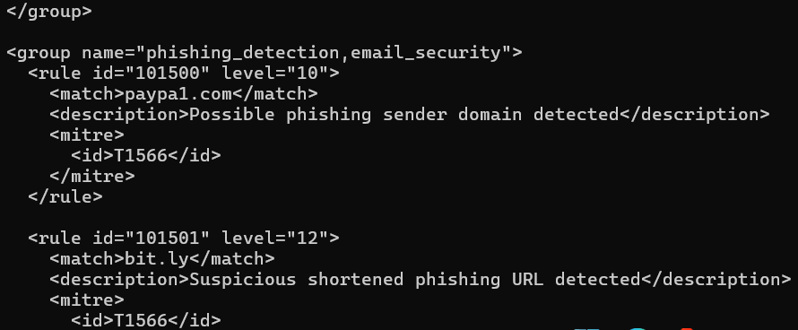 | Manager `local_rules.xml` showing the phishing detection rules `100500`–`100501`. |
| 12 | 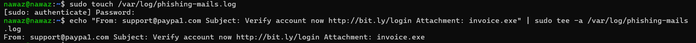 | Fake phishing log entry being written to `/var/log/phishing-mails.log` to trigger the custom rules. |
| 13 | 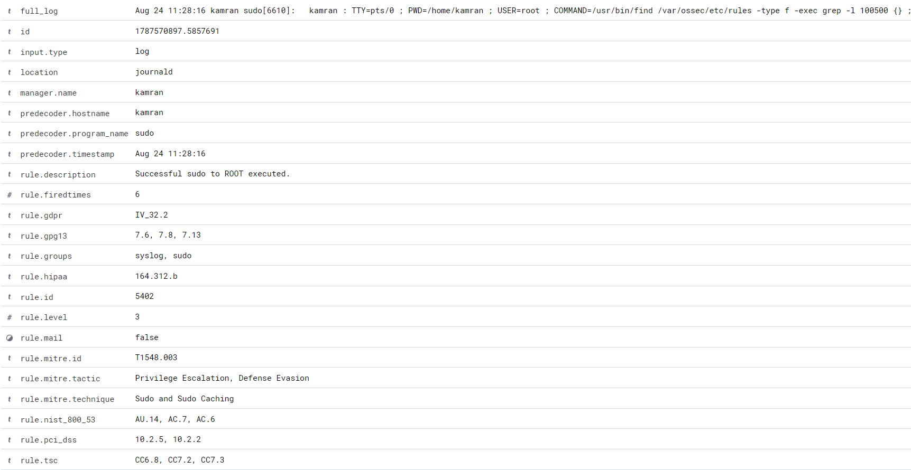 | Wazuh Dashboard → Agents → Security events showing the phishing detection rules firing. |

## Analyst notes

- **FIM:** monitoring `/root` and `C:\Users\Public` is a lab convenience — in production you'd scope this to directories that actually matter (config paths, web roots, `/etc`, `System32`) since broad realtime FIM on busy directories generates a lot of low-value noise.
- **Vulnerability detection:** this flags *known* CVEs against installed package versions — it won't catch zero-days or misconfigurations. Pair it with a patch-cadence SLA (e.g. "critical CVEs patched within 7 days") so the findings actually drive action instead of piling up.
- **VirusTotal:** rate-limited on the free API tier — fine for a lab, but in production you'd want a paid tier or a local sandbox (e.g. CAPEv2) so file-reputation checks aren't the bottleneck during an actual incident. See `05-n8n-fim-automation/` for a standalone alerting extension built on top of this.
- **Phishing detection:** matching on `paypa1.com` and `bit.ly` is intentionally naive (typosquat + generic shortener) — a real ruleset would pull from a maintained threat-intel feed rather than hardcoded strings, and the "future work" items in the root README (base64 detection, frequency correlation) are the natural next iteration.
