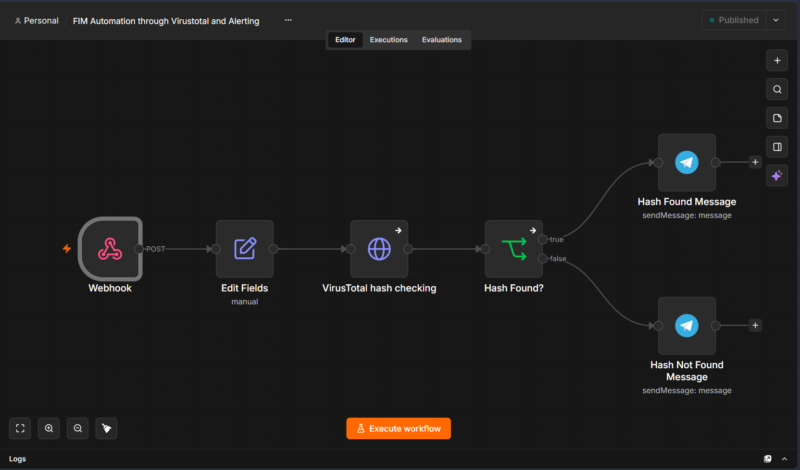
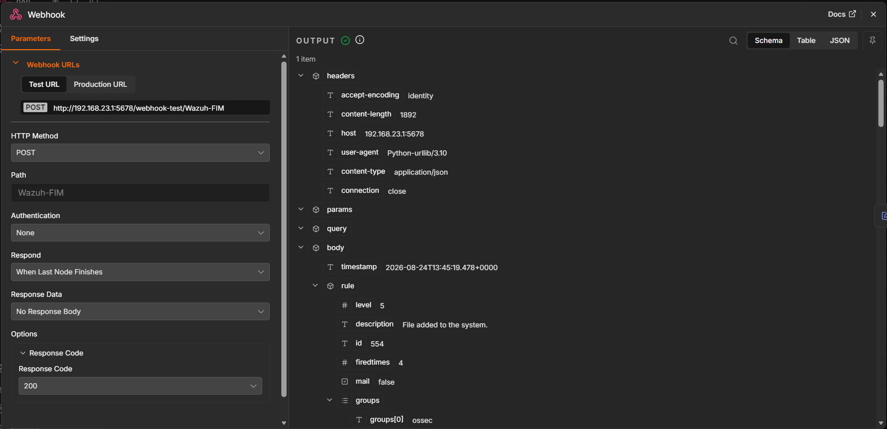
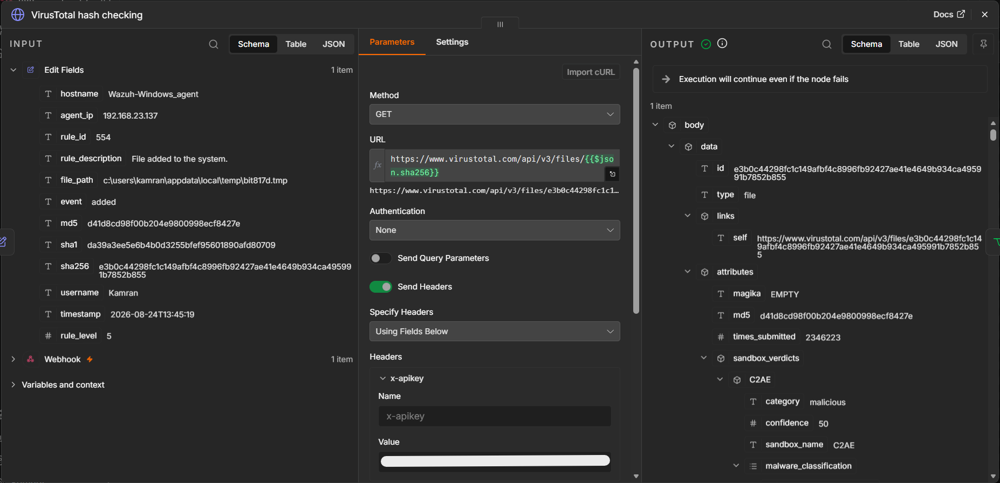
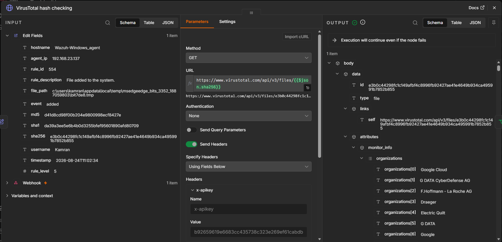
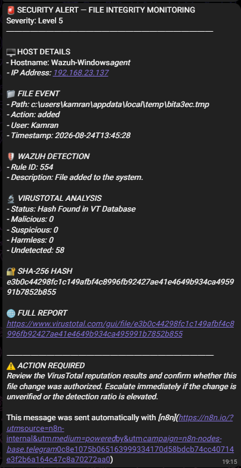
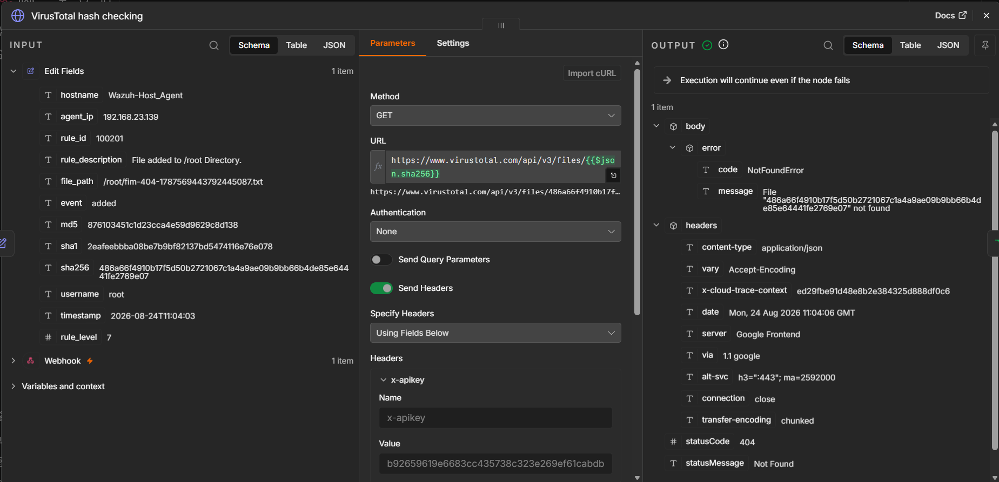
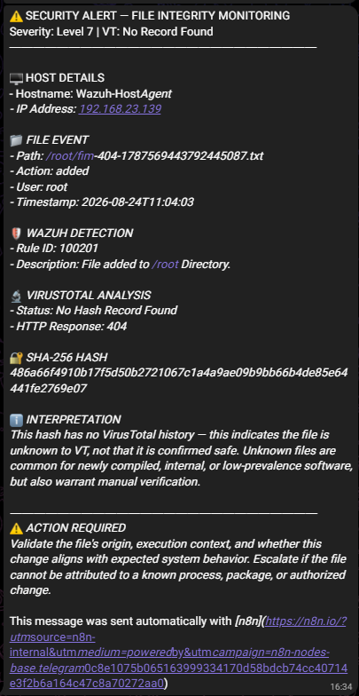

# 05 — FIM Automation Extension (n8n: VirusTotal Hash Lookup + Telegram Alerting)

Standalone [n8n](https://n8n.io) workflow extending `04-cross-platform`'s FIM and VirusTotal detections: decouples hash-reputation alerting from Wazuh itself. A webhook receives a file hash (handed off from a FIM event), checks it against VirusTotal, and pushes a verdict straight to Telegram — independent of Wazuh's rule engine and dashboard.

## What's being tested

Whether hash-reputation alerting can run as a fan-out layer outside the SIEM — same VirusTotal verdict, delivered wherever you want (Telegram here, Slack/email/ticket later) without touching Wazuh's rule engine per channel added.

## Workflow

`Webhook (POST)` → `Edit Fields` (manual — normalizes payload to a single `hash` field) → `VirusTotal hash checking` (HTTP Request to VT API) → `Hash Found?` (IF node, true/false) → `Hash Found Message` / `Hash Not Found Message` (Telegram `sendMessage`, one per branch).

## Setup

1. **Webhook node** — set to `POST`. Entry point; wire it to receive a hash from wherever your FIM pipeline hands one off (Wazuh active-response script, scheduled export, or manual test `curl`).
2. **Edit Fields node** (Set node, manual mode) — maps incoming payload down to a single `hash` field so downstream nodes don't care what the source payload looked like.
3. **VirusTotal hash checking node** — HTTP Request node calling VT's file-lookup endpoint (`GET https://www.virustotal.com/api/v3/files/{{ $json.hash }}`) with your API key sent as the `x-apikey` header. Store the key as an n8n credential, not hardcoded in the node.
4. **Hash Found? node** — IF node branching on the VT response (e.g., HTTP `200` + `last_analysis_stats.malicious > 0` → true; `404` or a clean report → false).
5. **Telegram nodes** — `sendMessage` on each branch, each using a bot token + chat ID credential, posting the verdict to your alerting channel.

## Trigger it end-to-end

```bash
# Simulate a FIM event handing off a hash to n8n — run from anywhere that can reach the n8n host
curl -X POST https://<n8n-host>/webhook/<webhook-id> \
  -H "Content-Type: application/json" \
  -d '{"hash": "<sha256-of-a-test-file>"}'
```
Use a known-malicious published hash (e.g. the EICAR file's SHA256) to exercise the **Hash Found** branch, and the hash of a benign file you created yourself to exercise **Hash Not Found**.

## Screenshot Evidence

| # | Screenshot | What it captures |
|---|---|---|
| 1 |  | Full n8n workflow canvas showing **Webhook → Edit Fields → VirusTotal lookup → Branch → Telegram**. |
| 2 |  | n8n execution showing the incoming **webhook POST** and the submitted file hash. |
| 3 |  | VirusTotal hash-checking node output showing the **raw API response**. |
| 4 |  | n8n execution trace showing the **true / Hash Found branch** after the VirusTotal lookup. |
| 5 |  | Actual Telegram notification received when the submitted hash is **found**. |
| 6 |  | n8n execution trace showing the **false / Hash Not Found branch** for a benign or unknown hash. |
| 7 |  | Actual Telegram notification received when the submitted hash is **not found**. |

## Analyst notes

- Duplicates part of what Wazuh's native VirusTotal integration (`04-cross-platform`, section C) already does. Value is **decoupling alerting from the SIEM** — same verdict fans out to Telegram, Slack, email, or a ticket without touching Wazuh's rule engine per channel added.
- "Hash Not Found" means VirusTotal has no record of that hash yet — not that the file is safe. Word the Telegram message so on-call responders don't read it as a clean bill of health.
- Add a shared secret / HMAC check on the webhook and rate-limit/queue it — VirusTotal's free tier caps at 4 requests/minute, and an unauthenticated public webhook can be triggered by anyone who finds the URL.
- Next step: extend the false/true branches to also open a ticket (e.g. TheHive), not just message Telegram — turns this into a real triage entry point instead of a notify-only channel.
