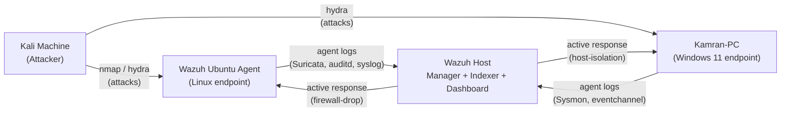

# SOC Detection Lab

A self-hosted SOC lab built on Wazuh (Manager + Indexer + Dashboard) monitoring a Linux and a Windows endpoint, with a Kali box as the attacker. Each detection scenario below is triggered on purpose, verified in the Wazuh dashboard, and documented with the exact commands used — screenshots included as proof.

## Why this lab

Demonstrates end-to-end SOC workflows: log ingestion, custom detection rules, MITRE ATT&CK mapping, and automated active response (firewall blocking, host isolation) — not just "installed a SIEM," but "built and validated detections against real attack simulations."

## Lab topology

| VM | Role | OS |
|---|---|---|
| Wazuh Host | Wazuh Manager + Indexer + Dashboard | Ubuntu Server 22.04 |
| Wazuh Ubuntu Agent | Wazuh Agent #1 (Linux endpoint) | Ubuntu Server 22.04 |
| Kamran-PC | Wazuh Agent #2 (Windows endpoint) | Windows 11 |
| Kali Machine | Attacker | Kali Linux |

All four VMs sit on the same host-only/NAT network. Note each VM's IP before starting.



## Tools & technologies

| Tool | Purpose | Runs on |
|---|---|---|
| Wazuh Manager / Indexer / Dashboard | SIEM core — log collection, rules engine, alerting, visualization | Wazuh Host |
| Wazuh Agent | Log/event forwarding | Wazuh Ubuntu Agent, Kamran-PC |
| Suricata | Network intrusion detection (NIDS) | Wazuh Ubuntu Agent |
| auditd | Linux command/process auditing | Wazuh Ubuntu Agent |
| Sysmon | Windows process/event telemetry | Kamran-PC |
| iptables | Active-response firewall blocking | Wazuh Ubuntu Agent |
| Windows Firewall / netsh | Active-response host isolation | Kamran-PC |
| VirusTotal API | File reputation lookups on FIM events | Wazuh Host |
| n8n | Standalone hash-lookup + alerting workflow, decoupled from the SIEM | External (n8n host) |
| Telegram Bot API | Push alerting for the n8n hash-verdict workflow | External (n8n host) |
| Hydra / Nmap | Attack simulation | Kali Machine |

## MITRE ATT&CK coverage

| Detection scenario | Technique | ID | Source |
|---|---|---|---|
| Malicious command execution (auditd) | Command and Scripting Interpreter | T1059 | Explicit in custom rule 100300 |
| PowerShell execution (Sysmon) | Command and Scripting Interpreter: PowerShell | T1059.001 | Commonly mapped — verify against your rule |
| Phishing sender/URL/attachment detection | Phishing | T1566 | Explicit in custom rules 100500/100501/100503 |
| Malicious attachment (invoice.exe) | User Execution: Malicious File | T1204 | Explicit in custom rule 100502 |
| Suricata NIDS / nmap scan detection | Network Service Discovery / Active Scanning | T1046 / T1595 | Commonly mapped — verify against triggered Suricata rule |
| SSH brute force + firewall-drop | Brute Force | T1110 | Commonly mapped — verify against Wazuh rules 5710/5712/5715 |
| Host isolation (active response) | (Response control, not an attacker technique) | — | Mitigates whichever technique triggered rules 60122/60204 |
| File Integrity Monitoring | Data Manipulation / Indicator Removal (context-dependent) | T1565 / T1070 | Commonly mapped — tag per actual finding |
| VirusTotal-flagged file (EICAR test) | Ingress Tool Transfer | T1105 | Commonly mapped — EICAR is a benign AV test string |

> Rows marked "commonly mapped" aren't tagged in a Wazuh rule as-is — add `<mitre><id>...</id></mitre>` to the relevant `local_rules.xml` entries if you want the dashboard to show them natively.

## Repository structure

```
SOC-Detection-Lab/
├── README.md                        ← you are here
├── 01-manager-setup/
│   ├── README.md                    (install, password recovery, archives/Filebeat)
│   └── screenshots/
├── 02-linux-agent-detections/
│   ├── README.md                    (Suricata NIDS, auditd, SSH brute force + active response)
│   └── screenshots/
├── 03-windows-agent-detections/
│   ├── README.md                    (Sysmon, PowerShell detection, host isolation)
│   └── screenshots/
├── 04-cross-platform/
│   ├── README.md                    (FIM, Vulnerability Detection, VirusTotal, Phishing)
│   └── screenshots/
└── 05-n8n-fim-automation/
    ├── README.md                    (n8n: VirusTotal hash lookup + Telegram alerting, extends FIM)
    └── screenshots/
```

Each section README follows the same pattern: **what's being tested → exact commands → screenshot checklist (mapped 1:1 to the command that produces it) → analyst notes** (what you'd check next: false-positive rate, rule tuning, escalation criteria).

## How to reproduce

1. Stand up the 4 VMs on one host-only/NAT network and note their IPs.
2. Work through `01-manager-setup/` first — everything downstream depends on the Manager being up.
3. Enrol both agents (`02-` and `03-` each start with agent enrolment).
4. Work through each section's scenarios in order, capturing screenshots per the checklist as you go.
5. Drop captured images into the matching `screenshots/` folder using the filenames suggested in each checklist, then update the image links in that section's README.

## Safety notes

- All attacks (`nmap`, `hydra`) are run against your own lab VMs only, on an isolated host-only/NAT network.
- The VirusTotal test file is the industry-standard **EICAR** string — a safe, non-malicious AV test signature, not real malware.
- Never commit real Wazuh admin passwords, VirusTotal API keys, or your lab's public IP to this repo. Redact them from screenshots before committing (see each section's checklist for which screenshots need redaction).

## Future work

- Base64-encoded payload detection in phishing logs (`[A-Za-z0-9+/]{100,}={0,2}` regex).
- Frequency-based correlation rules for repeated phishing attempts (`frequency="5" timeframe="60"`).
- Extended active response: block sender IP, quarantine attachment, disable user account, block URL via firewall.
- Extend the n8n workflow to also open a ticket (e.g. TheHive) alongside the Telegram alert, to simulate a full triage-to-close workflow.
- Add a shared-secret/HMAC check on the n8n webhook so it can't be triggered by anyone who finds the URL.

## License

MIT (or your preference) — this is a personal/portfolio lab, not production security tooling.
